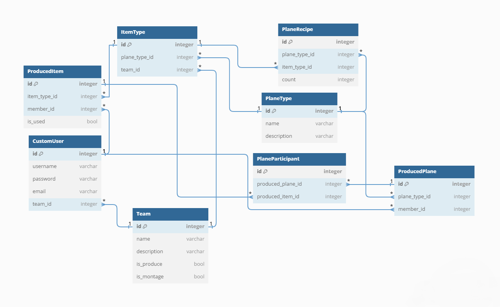
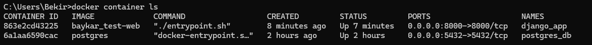
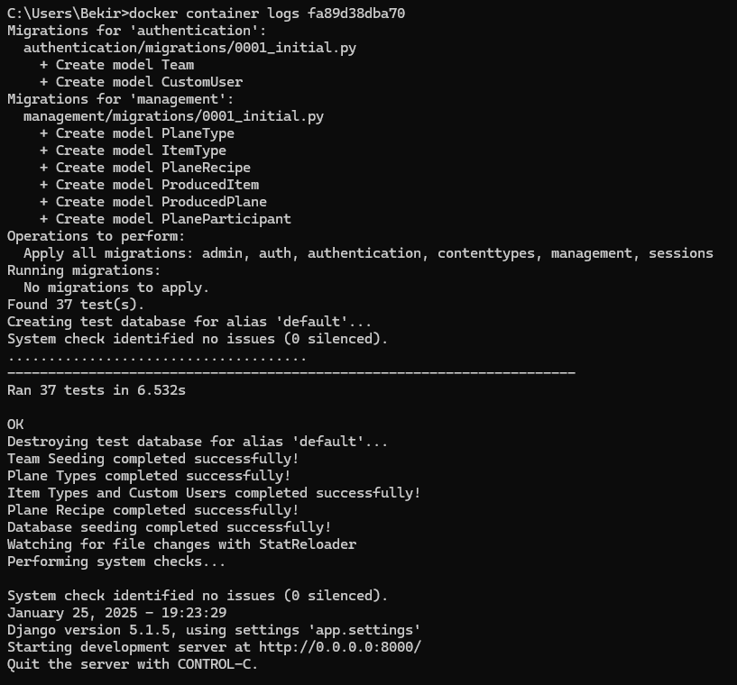

# Django ile Hava Aracı Üretim Uygulaması (Teknik Yeterlilik Testi)

## Problem Açıklaması
- Sistemde yer alacak olan 4 adet üretim takımı ve 1 adet montaj takımı yer almaktadır.
Bu takımlar toplamda 4 adet IHA tipinin bulunduğu her birinin kendine ait olduğu parçaları üretmekle görevlidir.
Toplamda üretilebilecek 16 adet parça tipi bulunan bu sistem, takımın görevleri doğrultusunda kendine ait olan parçaları üretebilir.
- Bir diğer takım olan montaj takımı ise, bu üretilen parçaları kullanarak uçağın üretim tarifine göre gereken parçaları envanterden alarak
uçağın projesini oluşturup montaj yapmakla görevlidir.

- Montaj takımı ürettiği uçağı listeleyebilir, üretim takımı da takımın ürettiği parçaları listeleyebilir.
- Montaj ekibinin uçak üretim yapmak istediği anda eksik parçanın olması, eksik parçaları ve gereken sayıları verebilmektedir.
- Üretilen parça, başka uçakta kullanılmamak üzere korunmalıdır.

## Veritabanı Diyagramı

- Veritabanı için toplamda 8 adet tabloya ihtiyaç duyulmuştur.


### Model Detayları
- Team modeli, takımların isimlerini ve yeteneklerini tutmaktadır. Montaj takımı için has_montage verisi, üretim takımları için has_produce verisi "True" olmalıdır.
- CustomUser modeli, django.auth paketinden AbstractBaseUser sınıfı miras alınarak oluşturulmuştur. Team modeli ile OneToMany ilişkisi yaratılmıştır. Bir kullanıcı bir takıma sahip olabilir ve bir takımda birden fazla kullanıcı bulunabilir.
- PlaneType modeli, istenen uçakların isimleri tutmaktadır.
- ItemType modeli, uçak tipini ve takım kimliği tutmaktadır. Bu durumda takımın sorumluluğu dışında parça üretilmesinin önüne geçilmiştir. Uçak tipi ile hangi uçağa uygun olduğu belirlenmiştir.
- PlaneRecipe modeli, uçak tipini, parça tipinin kimliğini ve gereken parça sayısını tutmaktadır. Üretim için önemli bir modeldir.
- ProducedItem modeli, kişinin kimliği ve parça kimliğini tutmaktadır. Parçayı kimin ürettiğini ve hangi parça olduğu bilgilerini tutmaktadır. Eğer parça bir uçakta kullanıldıysa, içerisinde yer alan "is_used" verisi "True" olarak değiştirilir. Bu yöntemle tek bir tablo kullanarak üretilen parçalar rahatlıkla korunabilmektedir. Başka bir üretimde kullanılması ve geri dönüştürülmesi engellenmektedir.
- ProducedPlane modeli, montaj yapılmadan önce ortaya bir uçak projesi çıkarılması gerektiğinden dolayı eklenmiştir. Gerekli parçaların olması durumunda proje olarak yaratılır.
- PlaneParticipant modeli, gerekli parçaların olduğu ve uçak projesi yaratıldıktan sonra hangi uçakta hangi parçaların kullanıldığını verilerini tutmaktadır. Gereken parça sayısına göre ekleme sayısı değişebilir.

## Projenin Çalıştırılması

##### !Projenin çalıştırılması için docker ve git uygulaması gerekmektedir. 

Öncelikle Repository olarak çalıştırılmak istenen bilgisayara aşağıdaki kod ile yüklenmelidir.
```shell
mkdir my_app
cd my_app
git clone https://github.com/bekirin50tonu/Baykar-Test-Case.git
```
Repository yüklendikten sonra dizine girilmeli ve aşağıdaki kod çalıştırılmalıdır.
```shell
docker compose -f "docker-compose.yml" up -d --build
```
Projenin çalıştığına emin olmak için yapılması gereken ise yapılması gereken container bilgisine bakmaktır. Aşağıdaki kodu çalıştırabilirsiniz.
```shell
docker container ls
```
Göründüğü gibi 2 adet container çalışmaktadır. Birisi veritabanı ve diğeri sunucu sistemidir. Kod sonrası aşağıdaki şekilde görünmelidir.


Container Id kodunu kopyaladıktan sonra aşağıdaki gibi konsol kayıt bilgilerine ulaşabilirsiniz.


## Proje Detayları

- Sistemde toplamda 12 adet endpoint bulunmaktadır. Her bir endpoint için başarılı ve başarısız olduğu durumlarda vereceği cevaplardan dolayı toplamda test sayısı 37 olacak şekilde oluşturulmuştur. 
- Sistemde 3 adet uygulama bulunmaktadır. Kimlik doğrulama ve yetkilendirme işlemleri için *Authentication* uygulaması yer almaktadır. Üretim ve montaj endpointleri için *Management* uygulaması yer almaktadır. Görünen taraf için ise *templates* uygulaması yer almaktadır.
- Uygulamanın başlayabilmesi için entrypoint.sh dosyası çalıştırılmalıdır.

### Nasıl Çalışır?

Uygulamanın çalışması için entrypoint.sh uygulamasının linux, yani docker ortamında çalıştırılması gerekmektedir. Aşağıdaki kodlarda detaylar açıklanmıştır.
```shell
#!/bin/bash

# Veritabanı sıfırlama işlemini gerçekleştirir.
python manage.py flush --no-input 

# Veritabanı için eklenmesi, düzeltilmesi ve silinmesi gereken tabloları bu kod yardımıyla oluşturur.
python manage.py makemigrations 

# Veritabanı için oluşturulan python kodlarını bu kod yardımıyla veritabanına yapılması gereken işlemleri yapılır.
python manage.py migrate

# Uygulama başlamadan önce endpoint testleri gerçekleştirilir.
python manage.py test

# Uygulama için gereken verileri bu kod yardımıyla eklemesi yapılır. 
python manage.py seed_database

# Sunucuyu çalıştırır.
python manage.py runserver 0.0.0.0:8000
```
### Detaylar
- Seed_database komutu, sonradan oluşturulmuş bir komuttur. Bu komut sistem için gerekli olan takım,uçak tipleri ve parça tipleri gibi verileri kullanılabilir şekilde eklemektedir. Superuser kullanıcısı da bulunmaktadır fakat herhangi bir takıma sahip olmadığı için montaj ve üretim sistemine erişmesi mümkün değildir. Sadece veritabanı ile alakalı admin sayfasında çalışabilmektedir.
### Swagger Dokümanları

Döküman bilgilerine erişebilmek için aşağıdaki bilgilere tıklayarak detayları inceleyebilirsiniz.
- [Authentication](authentication/README.md)
- [Management](management/README.md)


### Projenin Ön Yüzü
Projenin ön yüzü, 4 temel sayfadan oluşmaktadır. Bu sayfaları incelemek için aşağıdaki linke tıklayarak ulaşabilirsiniz..
- [Templates](templates/README.md)

## Kullanılan Teknolojiler

### Django Backend Sistemi
- Django~=5.1.5 (Temel Kütüphane)
- djangorestframework~=3.15.2 (Rest Framework)
- djangorestframework-datatables==0.7.2 (Server-Side Datatable)
- drf-yasg~=1.21.8 (Swagger Doküman)

### Front-End Teknolojileri
- Tailwind
- JQuery
- Ajax
- Fetch


