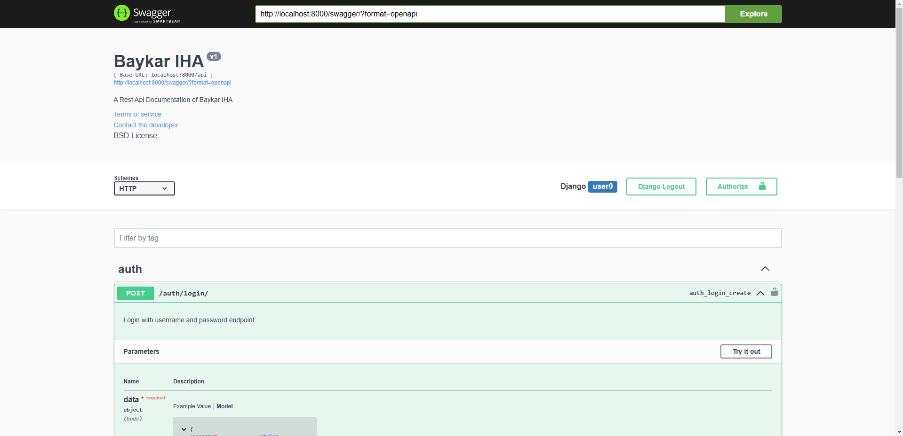
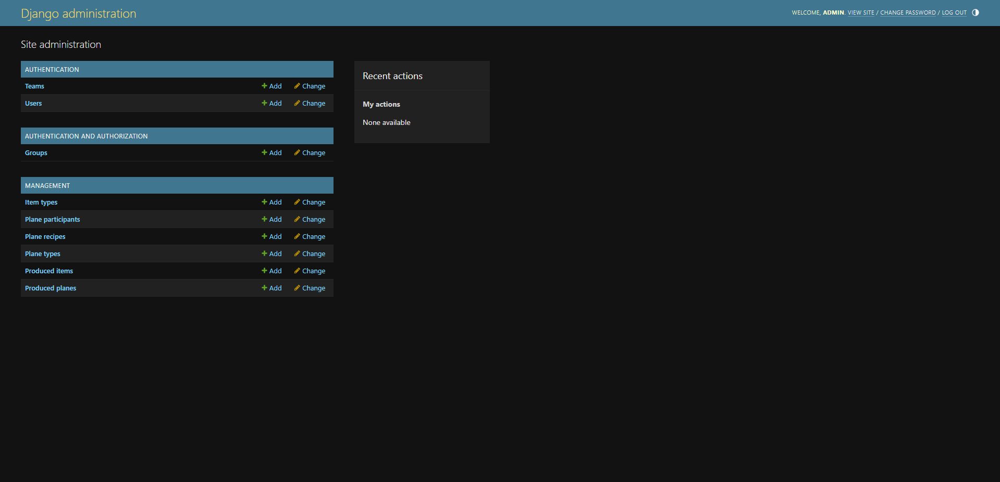
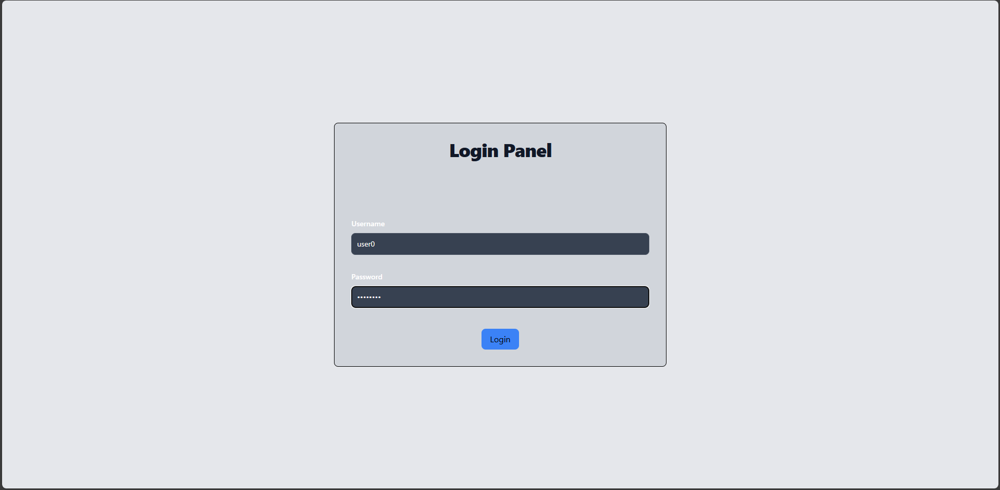
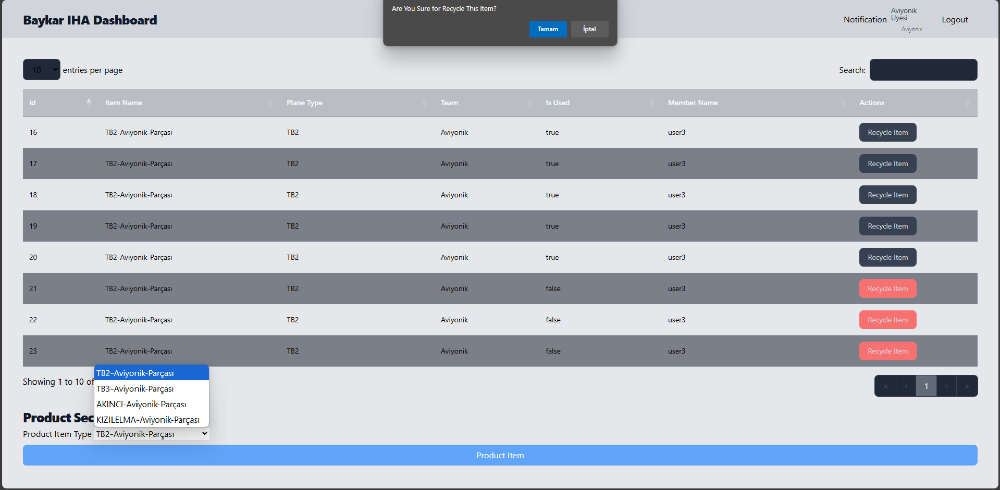
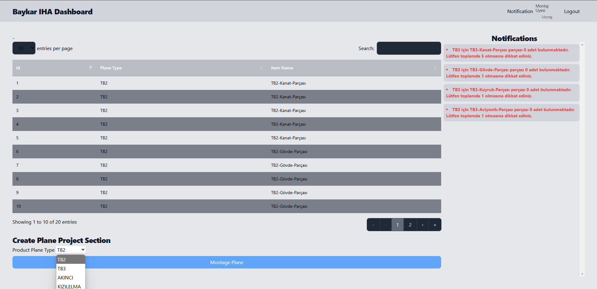

# Templates Uygulaması Detayları

## Sayfa Detayları
Sistemde 5 adet erişilebilir sayfa bulunmaktadır. Bu sayfalar Admin, Giriş, Üretim ve Montaj ekranlarıdır.

### Swagger Döküman Sayfası
Swagger ile api endpoint tanımlamaları içeren sayfadır. __drf-yasg__ paketi kullanarak hazırlanmıştır. Aşağıdaki adres ile erişilebilmektedir.
```http request
http://localhost:8080/swagger
```


### Admin Ekranı

Bir superuser olarak temel sistemin yönetilmesinin sağlanması gerekmektedir. Bu sisteme erişebilmek için aşağıdaki adrese gitmeniz gerekir.
```http request
http://localhost:8080/admin
```

Sisteme giriş ekranı gelmektedir. Ekranda yer alan username ve password bilgileri aşağıda yer almaktadır.
- **Username:** admin
- **Password:** password

Sisteme başarıyla giriş yaptıktan sonra aşağıdaki gibi verileri yönetebilirsiniz.


### Giriş Ekranı

Giriş ekranına erişebilmek için girilmesi gereken adres aşağıda yer almaktadır.
```http request
http://localhost:8080/
```
Ekranda yer alan username ve password bilgileri aşağıda yer almaktadır. Database_seeder ile 5 adet kullanıcı yaratılmıştır ve sistemi test edebilmek için giriş yapılabilmektedir. Detaylar aşağıdaki gibidir.
- **Username:** user0 **Takım:** Kanat Takımı
- **Username:** user1 **Takım:** Gövde Takımı
- **Username:** user2 **Takım:** Kuyruk Takımı
- **Username:** user3 **Takım:** Aviyonik Takımı
- **Username:** user4 **Takım:** Montaj Takımı

> !! Her kullanıcı için parola sabittir ve **parola** ise password olarak ayarlanmıştır.



Giriş işlemi başarılıysa uyarı mesajı ile görevli olduğu siteye yönlendirilirken bilgiler yanlış işe uyarı ile hata mesajını göstermektedir.

### Üretim Ekranı

Üretim ekranına erişebilmek için kullanıcının __has_produce__ yetkisi bulunan bir takıma üye olmalıdır. Eğer üye ise aşağıdaki gibi kendi takımının ürettiği parçaları görüntüleyecebileceği, üretebileceği ve kullanılmayan parçaları geri dönüştürebileceği yeteneklere sahip bir sisteme giriş yapacaktır.
```http request
http://localhost:8080/dashboard
```


Verilerin listelenebileceği bir arayüze sahip olacak ve kendi takımının parçalarını üretebilecektir. Kullanılan parçaların geri dönüşüm butonu kapalıdır ve rengi normal butona göre koyu renklidir. Eğer kullanılmayan parçayı geri dönüştürmek isterse butona tıklayıp gelen uyarıyı onaylaması yeterlidir.

### Montaj Ekranı

Montaj ekranına erişebilmek için kullanıcının __has_montage__ yetkisi bulunan bir takıma üye olması gerekmedir. Üye aşağıdaki gibi üretilen uçakta kullanılan parçaları listeleyebilmektedir. 
```http request
http://localhost:8080/montage
```


Kullanıcı göründüğü gibi önceki üretimlerde kullanılan parçaları listeleyebilmektedir. Eğer üretmek istediği uçak modelinin parçası envanterde yeterli durumda değilse __Notifications__ kısmında listelenebilmektedir.
